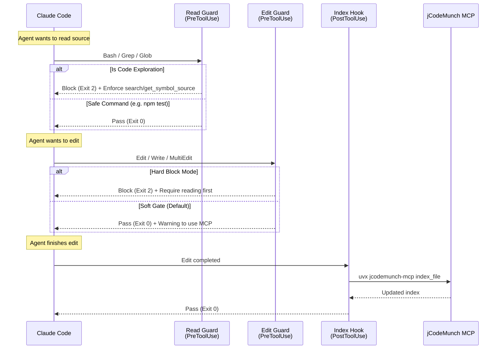

# Agent Hooks & Prompt Policies for jCodeMunch

> **Quick setup:** [QUICKSTART.md](QUICKSTART.md) · **Full tool reference:** [USER_GUIDE.md](USER_GUIDE.md)

Installing jCodeMunch makes the tools available. It does **not** guarantee your agent will use them.

The common failure mode isn't forgetting — it's skipping. The agent sees the rule in CLAUDE.md and reaches for Read or Grep anyway because native tools feel faster under pressure or in a long session. A prompt policy can't stop this. The hooks below intercept at the tool-call level: they fire *before* the shortcut executes and redirect Claude before the bypass happens.

This document covers two ways to enforce usage:

1. **Basic Setup (Prompt Policies)** — soft rules for any agent (Claude Code, Cursor, VS Code)
2. **Advanced Setup (Tool Hooks)** — hard redirects at the tool-call level (Claude Code only)

---

## Contents

- [Basic Setup: Prompt Policies](#basic-setup-prompt-policies)
  - [Claude Code (CLAUDE.md)](#claude-code-claudemd)
  - [Other AI Agents](#other-ai-agents)
- [Advanced Setup: Tool Hooks (Claude Code)](#advanced-setup-tool-hooks-claude-code)
  - [Hook Flow](#hook-flow)
  - [1. Read Guard (`jcodemunch_read_guard.sh`)](#1-read-guard-jcodemunch_read_guardsh)
  - [2. Edit Guard (`jcodemunch_edit_guard.sh`)](#2-edit-guard-jcodemunch_edit_guardsh)
  - [3. Index Hook (`jcodemunch_index_hook.sh`)](#3-index-hook-jcodemunch_index_hooksh)
  - [Installation & Setup](#installation--setup)
  - [PowerShell (PS1) Hooks](#powershell-ps1-hooks)
    - [Shared Module (`JcmHooks.psm1`)](#shared-module-jcmhookspsm1)
    - [1. Read Guard (`jcodemunch_read_guard.ps1`)](#1-read-guard-jcodemunch_read_guardps1)
    - [2. Edit Guard (`jcodemunch_edit_guard.ps1`)](#2-edit-guard-jcodemunch_edit_guardps1)
    - [3. Index Hook (`jcodemunch_index_hook.ps1`)](#3-index-hook-jcodemunch_index_hookps1)
    - [PowerShell Installation & Setup](#powershell-installation--setup)
    - [PowerShell Verify](#powershell-verify)
  - [Logging & Debugging](#logging--debugging)

---

## Basic Setup: Prompt Policies

Prompt policies tell your agent *which* jCodeMunch tool to reach for — so it routes correctly without needing to be blocked. Add these instructions to your agent's system prompt or rules file.

### Claude Code (CLAUDE.md)

Add the following to `~/.claude/CLAUDE.md` (global) or a project-level `CLAUDE.md`:

```markdown
## Code Exploration Policy

Always use jCodemunch-MCP tools for code navigation. Never fall back to Read, Grep, Glob, or Bash for code exploration.

**Start any session:**
1. `resolve_repo { "path": "." }` — confirm the project is indexed. If not: `index_folder { "path": "." }`
2. `suggest_queries` — when the repo is unfamiliar

**Finding code:**
- symbol by name → `search_symbols` (add `kind=`, `language=`, `file_pattern=` to narrow)
- string, comment, config value → `search_text` (supports regex, `context_lines`)
- database columns (dbt/SQLMesh) → `search_columns`

**Reading code:**
- before opening any file → `get_file_outline` first
- one or more symbols → `get_symbol_source` (single ID → flat object; array → batch)
- symbol + its imports → `get_context_bundle`
- specific line range only → `get_file_content` (last resort)

**Repo structure:**
- `get_repo_outline` → dirs, languages, symbol counts
- `get_file_tree` → file layout, filter with `path_prefix`

**Relationships & impact:**
- what imports this file → `find_importers`
- where is this name used → `find_references`
- is this identifier used anywhere → `check_references`
- file dependency graph → `get_dependency_graph`
- what breaks if I change X → `get_blast_radius` (add `include_depth_scores=true` for layered risk, `include_source=true` for fix-ready context)
- what symbols actually changed since last commit → `get_changed_symbols`
- find unreachable/dead code → `find_dead_code`
- most important symbols by architecture → `get_symbol_importance`
- class hierarchy → `get_class_hierarchy`
- callers/callees of a symbol → `get_call_hierarchy`
- high-risk symbols (complexity × churn) → `get_hotspots`
- related symbols → `get_related_symbols`
- diff two snapshots → `get_symbol_diff`
- symbols by decorator → `search_symbols(decorator="...")` or `get_blast_radius(decorator_filter="...")`

**Session awareness:**
- starting a task → `plan_turn` (confidence + recommended symbols/files)
- session history → `get_session_context`
- after editing → `register_edit` (invalidates caches)

**Retrieval with token budget:**
- best-fit context for a task → `get_ranked_context` (query + token_budget)
- bounded symbol bundle → `get_context_bundle` (add token_budget= to cap size)

**After editing a file:** `index_file { "path": "/abs/path/to/file" }` to keep the index fresh.
```

### Other AI Agents

Create or edit one of the following files depending on your editor:

- Cursor: **`.cursor/rules`**
- VS Code: **`.github/copilot-instructions.md`**
- Google Antigravity: **`.antigravity/rules`**

```text
jCodemunch-MCP is available. Use it instead of native file tools for all code exploration.

Start any session: resolve_repo → (if missing) index_folder → suggest_queries

Finding code:
  symbol by name       → search_symbols (kind=, language=, file_pattern= to narrow)
  string/comment/TODO  → search_text (is_regex=true for patterns, context_lines for context)
  database columns     → search_columns

Reading code:
  before opening a file → get_file_outline first
  one or more symbols   → get_symbol_source (symbol_id for one, symbol_ids[] for batch)
  symbol + imports      → get_context_bundle
  line range only       → get_file_content (last resort)

Repo structure:
  overview  → get_repo_outline
  files     → get_file_tree

Relationships & impact:
  what imports a file             → find_importers
  where is a name used            → find_references
  is this identifier used         → check_references
  file dependency graph           → get_dependency_graph
  what breaks if I change X       → get_blast_radius (include_depth_scores=true for layered risk)
  what symbols changed in git     → get_changed_symbols
  find unreachable/dead code      → find_dead_code
  most important symbols          → get_symbol_importance
  class hierarchy                 → get_class_hierarchy
  callers/callees of a symbol     → get_call_hierarchy
  high-risk symbols               → get_hotspots (complexity × churn)
  circular dependencies           → get_dependency_cycles
  symbols by decorator            → search_symbols(decorator="route") or get_blast_radius(decorator_filter="...")

Session awareness:
  starting a new task             → plan_turn (confidence + recommended symbols)
  what have I already read        → get_session_context
  after editing a file            → register_edit (invalidates caches)

Retrieval with token budget:
  best-fit context for a task     → get_ranked_context (query + token_budget)
  bounded symbol bundle           → get_context_bundle (token_budget= to cap size)

After editing a file: index_file { "path": "/abs/path" } to keep the index fresh.
```

---

## Advanced Setup: Python CLI Hooks (Recommended)

> **New in v1.21.27+.** The fastest way to get enforcement hooks. Install with one command:

```bash
jcodemunch-mcp init --hooks
```

This installs three Python CLI hooks into `~/.claude/settings.json`:

| Hook | Event | What it does |
|------|-------|-------------|
| `hook-pretooluse` | `PreToolUse` | **Read Guard** — intercepts `Read` calls on large code files (>=4KB). Instead of blocking, emits a stderr warning suggesting `get_file_outline` + `get_symbol_source`. Targeted reads (with `offset`/`limit`) pass silently. Does **not** deny Read (Edit/Write require a prior Read). |
| `hook-posttooluse` | `PostToolUse` | **Auto-Reindex** — fires after `Edit` or `Write` on code files. Spawns `jcodemunch-mcp index-file` in the background to keep the index fresh automatically. |
| `hook-precompact` | `PreCompact` | **Session Snapshot** — generates a compact session snapshot before Claude Code context compaction and injects it via `systemMessage` so session orientation survives compaction. |

These hooks are idempotent (safe to re-run), backup-aware, and respect `--dry-run`.

> **macOS / Linux note (v1.80.5+):** `init --hooks` writes the **absolute path**
> to `jcodemunch-mcp` into `~/.claude/settings.json` — not the bare name. Claude
> Code spawns hooks via `/bin/sh`, which uses a minimal PATH that does **not**
> include `~/.local/bin`, `~/Library/Python/*/bin`, or pipx venvs. If you
> hand-edit hook commands or upgraded from a pre-1.80.5 install with the bare
> `jcodemunch-mcp ...` form, replace it with the output of `which jcodemunch-mcp`
> (or simply re-run `jcodemunch-mcp init --hooks` — it'll detect and migrate).

---

## Advanced Setup: Shell Script Hooks (Claude Code)

> **Disclaimer:** These shell hooks intercept internal Claude Code tool calls. They modify the core behavior of the agent to heavily prefer jCodeMunch over native file exploration. Use them to strictly enforce jCodeMunch usage, but be aware they may block legitimate edge cases.
>
> **Note:** The Python CLI hooks above are generally preferred — they're easier to install and maintain. Use shell hooks when you need custom logic or more aggressive blocking behavior (e.g., blocking Grep/Glob entirely).

Claude Code supports `PreToolUse` and `PostToolUse` hooks. We provide three scripts to secure the entire lifecycle of code reading and writing:

1. **Read Guard** (`PreToolUse`): Blocks grep/find commands so the agent searches via index instead. (Note: `Read` is intentionally NOT blocked — Edit/Write require a prior Read.)
2. **Edit Guard** (`PreToolUse`): Warns or blocks the agent before modifying files blindly without using jCodeMunch read tools.
3. **Index Hook** (`PostToolUse`): Automatically re-indexes files immediately after the agent modifies them.

### Hook Flow



### 1. Read Guard (`jcodemunch_read_guard.sh`)

Fires `PreToolUse`. Intercepts `Bash`, `Grep`, and `Glob` when they look like code exploration. Exit code `2` blocks the tool and sends your message back to Claude as feedback. Builds, tests, and git operations pass through untouched. (Note: `Read` is intentionally not blocked, as Edit/Write tools require a prior Read in session state).

**`~/.claude/hooks/jcodemunch_read_guard.sh`:**

```bash
#!/usr/bin/env bash
# PreToolUse guard: redirects code-exploration calls to jCodeMunch.
# Intercepts: Bash (grep/find/cat patterns), Grep, Glob.
# Read is intentionally NOT blocked — Edit/Write tools require a prior Read in session state.
# Exit 0 = pass through. Exit 2 = block with feedback.

# -e is intentionally omitted: helpers must never abort before the block message prints.
set -uo pipefail

INPUT=$(cat)
SCRIPT_DIR="$(cd "$(dirname "${BASH_SOURCE[0]}")" && pwd)"
LOG="${SCRIPT_DIR}/jcodemunch_read_guard.log"

# Set JCODEMUNCH_DEBUG=1 to enable logging.
log() { [[ "${JCODEMUNCH_DEBUG:-0}" == "1" ]] && echo "[$(date '+%H:%M:%S')] $*" >> "$LOG" || true; }

# Claude Code sends {"tool_name": "Read", "tool_input": {...}} via stdin.
# Fall back to env var for manual testing.
TOOL_NAME=$(echo "$INPUT" | python3 -c "import sys,json; d=json.load(sys.stdin); print(d.get('tool_name',''))" 2>/dev/null || true)
TOOL_NAME="${TOOL_NAME:-${CLAUDE_TOOL_NAME:-}}"

case "$TOOL_NAME" in
  Bash|Grep|Glob) ;;
  *) exit 0 ;;
esac

# Extract payload from tool_input (Claude Code) or top-level (manual testing)
export INPUT_JSON="$INPUT"
PAYLOAD=$(python3 - <<'PY'
import sys, json, os
try:
    d = json.loads(os.environ.get("INPUT_JSON", "{}"))
    # Claude Code wraps args in tool_input; fall back to top-level for manual tests
    inp = d.get("tool_input") or d
    print(" ".join(filter(None, [inp.get("command",""), inp.get("file_path",""), inp.get("pattern",""), inp.get("query","")])))
except Exception:
    pass
PY
) || true

log "TOOL=$TOOL_NAME PAYLOAD=$PAYLOAD"

EXT='py|ts|tsx|js|jsx|mjs|go|rs|java|rb|php|cs|cpp|c|h|swift|kt|scala|dart|lua|r|hs|ex|exs|sh|sql'
SAFE='(npm|yarn|pnpm|cargo|go |pytest|jest|vitest|rspec|mvn|gradle|git |docker|kubectl|uv |pip |brew |jcodemunch|uvx jcodemunch)'

IS_EXPLORATION=0

if [[ "$TOOL_NAME" == "Bash" ]]; then
    echo "$PAYLOAD" | grep -qE "$SAFE" && exit 0
    echo "$PAYLOAD" | grep -qEi "(grep|rg|find|cat|head|tail) .*\.($EXT)" && IS_EXPLORATION=1
fi
[[ "$TOOL_NAME" == "Grep" ]] && IS_EXPLORATION=1
[[ "$TOOL_NAME" == "Glob" ]] && echo "$PAYLOAD" | grep -qEi "\*\.($EXT)" && IS_EXPLORATION=1

[[ "$IS_EXPLORATION" -eq 0 ]] && exit 0

cat >&2 <<'EOF'
⛔ jCodeMunch guard — use structured retrieval instead.

  Discovery
  suggest_queries  → best first step for an unfamiliar repo
  get_repo_outline → high-level overview of the repo
  get_file_tree    → browse directory structure
  get_file_outline → list all symbols in a file (before reading any source)

  Retrieval
  search_symbols   → find a function/class/method by name
  get_symbol_source → fetch one symbol (symbol_id) or many (symbol_ids[])
  get_context_bundle → symbol + its imports (+ optional callers) in one call
  get_file_content → read a specific line range (last resort)

  Search
  search_text      → full-text search (strings, comments, TODOs)
  search_columns   → search dbt / SQLMesh / database column metadata

  Relationship & Impact
  find_importers   → what imports a file
  find_references  → where is an identifier used
  check_references → quick dead-code check
  get_dependency_graph → file-level dependency graph (up to 3 hops)
  get_blast_radius → what breaks if this symbol changes
  get_class_hierarchy  → full inheritance chain (ancestors + descendants)
  get_related_symbols  → symbols related via co-location / shared importers
  get_symbol_diff  → diff symbol sets between two indexed repo snapshots

  Utilities
  get_session_stats → token savings and cost-avoided breakdown for this session

Not indexed yet? → index_folder { "path": "/path/to/project" } first.
EOF

log "BLOCKED"
exit 2
```

### 2. Edit Guard (`jcodemunch_edit_guard.sh`)

Fires `PreToolUse`. Intercepts `Edit`, `Write`, and `MultiEdit`. By default, this is a **soft gate** that allows the edit but warns the agent to consult jCodeMunch first. You can enable a hard block to prevent blind edits via `JCODEMUNCH_HARD_BLOCK=1`.

**`~/.claude/hooks/jcodemunch_edit_guard.sh`:**

```bash
#!/usr/bin/env bash
# PreToolUse guard: nudges agent to consult jCodeMunch before editing.
# Intercepts: Edit, Write, MultiEdit.
# SOFT GATE — prints a warning to stderr but always exits 0 (edit proceeds).
# Hard-block mode: set JCODEMUNCH_HARD_BLOCK=1 in your environment.
# Exit 0 = pass through (with optional warning). Exit 2 = block (hard mode only).

# -e is intentionally omitted: helpers must never abort before the message prints.
set -uo pipefail

INPUT=$(cat)
SCRIPT_DIR="$(cd "$(dirname "${BASH_SOURCE[0]}")" && pwd)"
LOG="${SCRIPT_DIR}/jcodemunch_edit_guard.log"

# Set JCODEMUNCH_DEBUG=1 to enable logging.
log() { [[ "${JCODEMUNCH_DEBUG:-0}" == "1" ]] && echo "[$(date '+%H:%M:%S')] $*" >> "$LOG" || true; }

TOOL_NAME=$(echo "$INPUT" | python3 -c "import sys,json; d=json.load(sys.stdin); print(d.get('tool_name',''))" 2>/dev/null || true)
TOOL_NAME="${TOOL_NAME:-${CLAUDE_TOOL_NAME:-}}"

log "TOOL=$TOOL_NAME"

case "$TOOL_NAME" in
  Edit|Write|MultiEdit) ;;
  *) exit 0 ;;
esac

# Respect explicit allow — skip warning entirely.
[[ "${JCODEMUNCH_ALLOW_RAW_WRITE:-0}" == "1" ]] && exit 0

# Extract the target file path for a more helpful message.
export INPUT_JSON="$INPUT"
TARGET=$(python3 - <<'PY'
import sys, json, os
try:
    d = json.loads(os.environ.get("INPUT_JSON", "{}"))
    inp = d.get("tool_input") or d
    print(inp.get("file_path", ""))
except Exception:
    pass
PY
) || true

if [[ -n "$TARGET" ]]; then
    FILE_HINT="  Target file: $TARGET"
else
    FILE_HINT=""
fi

# Hard-block mode: exits 2 and prevents the edit.
HARD_BLOCK="${JCODEMUNCH_HARD_BLOCK:-0}"

if [[ "$HARD_BLOCK" == "1" ]]; then
    ICON="⛔"
    VERB="blocked"
    EXIT_CODE=2
else
    ICON="⚠️ "
    VERB="allowed — but consider consulting jCodeMunch first"
    EXIT_CODE=0
fi

cat >&2 <<EOF
$ICON jCodeMunch edit guard — raw file edit $VERB.
$FILE_HINT

Before writing to source files, jCodeMunch read tools give you safer context:

  get_symbol_source            → confirm you are editing the right implementation
  get_file_outline             → see all symbols in the file before touching it
  get_blast_radius             → understand what else breaks if you change this
  find_references              → find all call sites that may need updating too
  search_text                  → locate related strings, comments, or config values

To suppress this warning:  JCODEMUNCH_ALLOW_RAW_WRITE=1
To hard-block all edits:   JCODEMUNCH_HARD_BLOCK=1

Not indexed yet? → index_folder { "path": "/path/to/project" } first.
EOF

log "${VERB} tool=$TOOL_NAME file=$TARGET"
exit $EXIT_CODE
```

### 3. Index Hook (`jcodemunch_index_hook.sh`)

Fires `PostToolUse` for `Edit`, `Write`, and `MultiEdit`. It automatically updates the jCodeMunch index for the modified files so the agent always retrieves fresh code in subsequent steps.

**`~/.claude/hooks/jcodemunch_index_hook.sh`:**

```bash
#!/usr/bin/env bash
# PostToolUse hook: re-indexes a file in jCodeMunch after it is written.
# Triggers on: Edit, Write, MultiEdit.
# Requires: jcodemunch-mcp running and reachable via uvx (or PATH).
# Exit 0 always — index failures are logged but never block the agent.

set -uo pipefail

INPUT=$(cat)
SCRIPT_DIR="$(cd "$(dirname "${BASH_SOURCE[0]}")" && pwd)"
LOG="${SCRIPT_DIR}/jcodemunch_index_hook.log"

log() { [[ "${JCODEMUNCH_DEBUG:-0}" == "1" ]] && echo "[$(date '+%H:%M:%S')] $*" >> "$LOG" || true; }

# ── Extract tool name ────────────────────────────────────────────────────────
TOOL_NAME=$(echo "$INPUT" | python3 -c "
import sys, json
d = json.load(sys.stdin)
print(d.get('tool_name', ''))
" 2>/dev/null || true)
TOOL_NAME="${TOOL_NAME:-${CLAUDE_TOOL_NAME:-}}"

case "$TOOL_NAME" in
  Edit|Write|MultiEdit) ;;
  *) exit 0 ;;
esac

# ── Extract affected file path(s) ────────────────────────────────────────────
# Edit / Write  → tool_input.file_path  (single string)
# MultiEdit     → tool_input.edits[]    (array of {file_path, ...})
export INPUT_JSON="$INPUT"
FILE_PATHS=$(python3 - <<'PY'
import sys, json, os

try:
    d = json.loads(os.environ.get("INPUT_JSON", "{}"))
    inp = d.get("tool_input") or d

    paths = set()

    # Edit / Write
    fp = inp.get("file_path", "")
    if fp:
        paths.add(fp)

    # MultiEdit
    for edit in inp.get("edits", []):
        fp2 = edit.get("file_path", "")
        if fp2:
            paths.add(fp2)

    for p in sorted(paths):
        print(p)
except Exception as e:
    import sys
    print(f"parse-error: {e}", file=sys.stderr)
PY
) || true

if [[ -z "$FILE_PATHS" ]]; then
    log "SKIP tool=$TOOL_NAME — no file_path found"
    exit 0
fi

# ── Determine the repo root (best-effort) ───────────────────────────────────
# Walk up from the file to find the nearest .git, pyproject.toml, package.json,
# go.mod, Cargo.toml, or pom.xml — that becomes the index root.
find_repo_root() {
    local dir
    dir="$(cd "$(dirname "$1")" 2>/dev/null && pwd)" || return 1
    while [[ "$dir" != "/" ]]; do
        for marker in .git pyproject.toml package.json go.mod Cargo.toml pom.xml; do
            [[ -e "$dir/$marker" ]] && { echo "$dir"; return 0; }
        done
        dir="$(dirname "$dir")"
    done
    # Fall back to the file's own directory
    echo "$(cd "$(dirname "$1")" && pwd)"
}

# ── Re-index each affected file ─────────────────────────────────────────────
INDEX_FAILED=0

while IFS= read -r FILE_PATH; do
    [[ -z "$FILE_PATH" ]] && continue

    # Skip files that no longer exist (deleted in this edit).
    if [[ ! -f "$FILE_PATH" ]]; then
        log "SKIP $FILE_PATH — file does not exist (deleted?)"
        continue
    fi

    REPO_ROOT="$(find_repo_root "$FILE_PATH")"
    log "INDEX tool=$TOOL_NAME file=$FILE_PATH root=$REPO_ROOT"

    # Call jCodeMunch's index_file via the MCP CLI.
    # uvx runs jcodemunch-mcp on demand; swap for an absolute path if needed.
    INDEX_OUTPUT=$(uvx jcodemunch-mcp index_file \
        --path "$FILE_PATH" \
        --repo-root "$REPO_ROOT" \
        2>&1) || {
        log "ERROR indexing $FILE_PATH: $INDEX_OUTPUT"
        INDEX_FAILED=1
        continue
    }

    log "OK $FILE_PATH"
done <<< "$FILE_PATHS"

# ── Optional: surface index failures as a non-blocking hint ─────────────────
# PostToolUse hooks cannot block; we print to stderr so Claude Code can
# surface the message as a warning without interrupting the workflow.
if [[ "$INDEX_FAILED" -eq 1 ]]; then
    echo "⚠️  jCodeMunch: one or more files could not be re-indexed." \
         "Run index_folder manually if retrieval seems stale." >&2
fi

exit 0
```

### Installation & Setup

#### Step 1 — Save and make executable

Ensure the hooks folder exists:
```bash
mkdir -p ~/.claude/hooks
```

Save the three scripts above and make them executable:
```bash
chmod +x ~/.claude/hooks/jcodemunch_read_guard.sh
chmod +x ~/.claude/hooks/jcodemunch_edit_guard.sh
chmod +x ~/.claude/hooks/jcodemunch_index_hook.sh
```

#### Step 2 — Wire it up in settings

Merge into `~/.claude/settings.json`:

```json
{
  "hooks": {
    "PreToolUse": [
      {
        "matcher": "Bash|Grep|Glob",
        "hooks": [{"type": "command", "command": "CLAUDE_TOOL_NAME={{tool_name}} ~/.claude/hooks/jcodemunch_read_guard.sh"}]
      },
      {
        "matcher": "Edit|Write|MultiEdit",
        "hooks": [{"type": "command", "command": "CLAUDE_TOOL_NAME={{tool_name}} ~/.claude/hooks/jcodemunch_edit_guard.sh"}]
      }
    ],
    "PostToolUse": [
      {
        "matcher": "Edit|Write|MultiEdit",
        "hooks": [{"type": "command", "command": "CLAUDE_TOOL_NAME={{tool_name}} ~/.claude/hooks/jcodemunch_index_hook.sh"}]
      }
    ],
    "WorktreeCreate": [{
      "matcher": "",
      "hooks": [{"type": "command", "command": "jcodemunch-mcp hook-event create"}]
    }],
    "WorktreeRemove": [{
      "matcher": "",
      "hooks": [{"type": "command", "command": "jcodemunch-mcp hook-event remove"}]
    }]
  }
}
```

> `WorktreeCreate`/`WorktreeRemove` are only needed if you use `watch-claude`. Skip them if not.
>
> **Shortcut:** `jcodemunch-mcp init --hooks` automatically merges the `WorktreeCreate`/`WorktreeRemove` entries into your `settings.json`.

> [!IMPORTANT]
> **Reopen Claude Code** after every change to `~/.claude/settings.json`. Hooks are loaded at startup — a running session will not pick up changes until the app is restarted.

### Step 3 — Verify

Claude Code sends a JSON envelope with `tool_name` and `tool_input` keys. Simulate that format when testing manually:

```bash
# Should print redirect message and exit 2
echo '{"tool_name":"Grep","tool_input":{"pattern":"TODO"}}' \
  | ~/.claude/hooks/jcodemunch_read_guard.sh
echo "exit: $?"

# Should exit 0 — builds are not blocked
echo '{"tool_name":"Bash","tool_input":{"command":"npm test"}}' \
  | ~/.claude/hooks/jcodemunch_read_guard.sh
echo "exit: $?"
```

---

## PowerShell (PS1) Hooks

> For Windows users running Claude Code or other MCP clients in PowerShell.

The PowerShell hooks provide the same behavior as the bash scripts — read guard, edit guard, and index hook — but run natively on Windows without requiring WSL or Git Bash. All three scripts share a common module (`JcmHooks.psm1`) that handles JSON parsing, logging, and helper functions.

### Shared Module (`JcmHooks.psm1`)

Save this alongside the hook scripts. It provides `Read-HookInput`, `Write-HookLog`, `Get-CodeFileExtensions`, `Get-SafeCommandPatterns`, and `Find-RepoRoot` — used by all three hooks.

**`~/.claude/hooks/JcmHooks.psm1`:**

```powershell
$ErrorActionPreference = 'Continue'

function Parse-HookJson {
    <#
    .SYNOPSIS
    Parses hook JSON input string into a PSCustomObject with tool_name and tool_input.
    Falls back to $env:CLAUDE_TOOL_NAME if tool_name is missing.
    #>
    param(
        [Parameter(Mandatory)]
        [string]$InputJson
    )
    try {
        $d = $InputJson | ConvertFrom-Json
        $toolName = $d.tool_name
        if (-not $toolName) {
            $toolName = $env:CLAUDE_TOOL_NAME
        }
        $toolInput = $d.tool_input
        if (-not $toolInput) {
            $toolInput = $d.PSObject.Properties | Where-Object { $_.Name -ne 'tool_name' } | ForEach-Object { $_.Value }
            # tool_input missing — return raw object
        }
        return [PSCustomObject]@{
            tool_name  = if ($toolName) { $toolName } else { '' }
            tool_input = if ($toolInput) { $toolInput } else { $null }
        }
    }
    catch {
        return $null
    }
}

function Read-HookInput {
    <#
    .SYNOPSIS
    Reads JSON from stdin and returns parsed hook input.
    #>
    $json = [Console]::In.ReadToEnd()
    return Parse-HookJson -InputJson $json
}

function Write-HookLog {
    <#
    .SYNOPSIS
    Appends a timestamped log line. Only writes when $env:JCODEMUNCH_DEBUG -eq '1'.
    #>
    param(
        [Parameter(Mandatory)]
        [string]$LogPath,
        [Parameter(Mandatory)]
        [string]$Message
    )
    if ($env:JCODEMUNCH_DEBUG -ne '1') { return }
    $timestamp = Get-Date -Format 'HH:mm:ss'
    "[$timestamp] $Message" | Out-File -FilePath $LogPath -Append -Encoding utf8
}

function Get-CodeFileExtensions {
    <#
    .SYNOPSIS
    Returns a regex-escaped alternation string of known code file extensions.
    #>
    return 'py|ts|tsx|js|jsx|mjs|go|rs|java|rb|php|cs|cpp|c|h|swift|kt|scala|dart|lua|r|hs|ex|exs|sh|sql'
}

function Get-SafeCommandPatterns {
    <#
    .SYNOPSIS
    Returns a regex pattern matching commands that should always pass through the read guard.
    #>
    return 'npm|yarn|pnpm|cargo|go |pytest|jest|vitest|rspec|mvn|gradle|git |docker|kubectl|uv |pip |brew|jcodemunch|uvx jcodemunch'
}

function Find-RepoRoot {
    <#
    .SYNOPSIS
    Walks up from a file path to find the nearest repo root directory.
    Looks for: .git, pyproject.toml, package.json, go.mod, Cargo.toml, pom.xml.
    Falls back to the file's own parent directory.
    #>
    param(
        [Parameter(Mandatory)]
        [string]$FilePath
    )
    $markers = @('.git', 'pyproject.toml', 'package.json', 'go.mod', 'Cargo.toml', 'pom.xml')
    $resolved = Resolve-Path $FilePath -ErrorAction SilentlyContinue
    if ($resolved) {
        $dir = Split-Path -Parent $resolved
    } else {
        $dir = Split-Path -Parent $FilePath
    }
    if (-not $dir) { return $FilePath }

    while ($dir) {
        foreach ($marker in $markers) {
            if (Test-Path (Join-Path $dir $marker)) {
                return (Resolve-Path $dir).Path
            }
        }
        $parent = Split-Path -Parent $dir
        if ($parent -eq $dir) { break }
        $dir = $parent
    }

    $fallback = Split-Path -Parent $FilePath
    if ($fallback) {
        return (Resolve-Path $fallback).Path
    }
    return $FilePath
}

Export-ModuleMember -Function Parse-HookJson, Read-HookInput, Write-HookLog, Get-CodeFileExtensions, Get-SafeCommandPatterns, Find-RepoRoot
```

### 1. Read Guard (`jcodemunch_read_guard.ps1`)

Fires `PreToolUse`. Intercepts `Bash`, `Grep`, and `Glob` when they look like code exploration. Exit code `2` blocks the tool and sends your message back to Claude as feedback. Builds, tests, and git operations pass through untouched. (Note: `Read` is intentionally not blocked, as Edit/Write tools require a prior Read in session state).

**`~/.claude/hooks/jcodemunch_read_guard.ps1`:**

```powershell
# .claude/hooks/jcodemunch_read_guard.ps1
# PreToolUse guard: redirects code-exploration calls to jCodeMunch.
# Intercepts: Bash (grep/find/cat patterns), Grep, Glob.
# Read is intentionally NOT blocked — Edit/Write tools require a prior Read in session state.
# Exit 0 = pass through. Exit 2 = block with feedback.

$ErrorActionPreference = 'Continue'
Import-Module "$PSScriptRoot/JcmHooks.psm1" -Force

$scriptName = 'read_guard'
$logPath = Join-Path $PSScriptRoot "jcodemunch_$scriptName.log"

$parsed = Read-HookInput
if (-not $parsed) { exit 0 }

$toolName = $parsed.tool_name
Write-HookLog -LogPath $logPath -Message "TOOL=$toolName"

if ($toolName -notin @('Bash', 'Grep', 'Glob')) { exit 0 }

# Extract payload
$payload = ''
if ($parsed.tool_input.command) { $payload = $parsed.tool_input.command }
elseif ($parsed.tool_input.pattern) { $payload = $parsed.tool_input.pattern }
elseif ($parsed.tool_input.file_path) { $payload = $parsed.tool_input.file_path }
elseif ($parsed.tool_input.query) { $payload = $parsed.tool_input.query }

Write-HookLog -LogPath $logPath -Message "TOOL=$toolName PAYLOAD=$payload"

$codeExts = Get-CodeFileExtensions
$safePatterns = Get-SafeCommandPatterns
$isExploration = $false

if ($toolName -eq 'Bash') {
    if ($payload -match $safePatterns) { exit 0 }
    if ($payload -imatch "(grep|rg|find|cat|head|tail)\s+.*\.($codeExts)") { $isExploration = $true }
}
elseif ($toolName -eq 'Grep') {
    $isExploration = $true
}
elseif ($toolName -eq 'Glob') {
    if ($payload -imatch "\*\.($codeExts)") { $isExploration = $true }
}

if (-not $isExploration) { exit 0 }

# Block
$message = @"
jCodeMunch guard - use structured retrieval instead.

  Discovery
  suggest_queries  -> best first step for an unfamiliar repo
  get_repo_outline -> high-level overview of the repo
  get_file_tree    -> browse directory structure
  get_file_outline -> list all symbols in a file (before reading any source)

  Retrieval
  search_symbols   -> find a function/class/method by name
  get_symbol_source -> fetch one symbol (symbol_id) or many (symbol_ids[])
  get_context_bundle -> symbol + its imports (+ optional callers) in one call
  get_file_content -> read a specific line range (last resort)

  Search
  search_text      -> full-text search (strings, comments, TODOs)
  search_columns   -> search dbt / SQLMesh / database column metadata

  Relationship & Impact
  find_importers   -> what imports a file
  find_references  -> where is an identifier used
  check_references -> quick dead-code check
  get_dependency_graph -> file-level dependency graph (up to 3 hops)
  get_blast_radius -> what breaks if this symbol changes
  get_class_hierarchy  -> full inheritance chain (ancestors + descendants)
  get_related_symbols  -> symbols related via co-location / shared importers
  get_symbol_diff  -> diff symbol sets between two indexed repo snapshots

  Utilities
  get_session_stats -> token savings and cost-avoided breakdown for this session

Not indexed yet? -> index_folder { `"path`": `"/path/to/project`" } first.
"@

[System.Console]::Error.WriteLine($message)
Write-HookLog -LogPath $logPath -Message "BLOCKED"
exit 2
```

### 2. Edit Guard (`jcodemunch_edit_guard.ps1`)

Fires `PreToolUse`. Intercepts `Edit`, `Write`, and `MultiEdit`. By default, this is a **soft gate** that allows the edit but warns the agent to consult jCodeMunch first. You can enable a hard block to prevent blind edits via `JCODEMUNCH_HARD_BLOCK=1`.

**`~/.claude/hooks/jcodemunch_edit_guard.ps1`:**

```powershell
# .claude/hooks/jcodemunch_edit_guard.ps1
# PreToolUse guard: nudges agent to consult jCodeMunch before editing.
# Intercepts: Edit, Write, MultiEdit.
# SOFT GATE - prints a warning to stderr but always exits 0 (edit proceeds).
# Hard-block mode: set JCODEMUNCH_HARD_BLOCK=1 in your environment.
# Exit 0 = pass through (with optional warning). Exit 2 = block (hard mode only).

$ErrorActionPreference = 'Continue'
Import-Module "$PSScriptRoot/JcmHooks.psm1" -Force

$scriptName = 'edit_guard'
$logPath = Join-Path $PSScriptRoot "jcodemunch_$scriptName.log"

$parsed = Read-HookInput
if (-not $parsed) { exit 0 }

$toolName = $parsed.tool_name
Write-HookLog -LogPath $logPath -Message "TOOL=$toolName"

if ($toolName -notin @('Edit', 'Write', 'MultiEdit')) { exit 0 }

if ($env:JCODEMUNCH_ALLOW_RAW_WRITE -eq '1') { exit 0 }

$target = ''
if ($parsed.tool_input.file_path) { $target = $parsed.tool_input.file_path }
$fileHint = if ($target) { "  Target file: $target" } else { '' }

$hardBlock = $env:JCODEMUNCH_HARD_BLOCK -eq '1'

if ($hardBlock) {
    $verb = 'blocked'
    $exitCode = 2
} else {
    $verb = 'allowed - but consider consulting jCodeMunch first'
    $exitCode = 0
}

$message = @"
jCodeMunch edit guard - raw file edit $verb.
$fileHint

Before writing to source files, jCodeMunch read tools give you safer context:

  get_symbol_source            -> confirm you are editing the right implementation
  get_file_outline             -> see all symbols in the file before touching it
  get_blast_radius             -> understand what else breaks if you change this
  find_references              -> find all call sites that may need updating too
  search_text                  -> locate related strings, comments, or config values

To suppress this warning:  JCODEMUNCH_ALLOW_RAW_WRITE=1
To hard-block all edits:   JCODEMUNCH_HARD_BLOCK=1

Not indexed yet? -> index_folder { `"path`": `"/path/to/project`" } first.
"@

[System.Console]::Error.WriteLine($message)
Write-HookLog -LogPath $logPath -Message "$verb tool=$toolName file=$target"
exit $exitCode
```

### 3. Index Hook (`jcodemunch_index_hook.ps1`)

Fires `PostToolUse` for `Edit`, `Write`, and `MultiEdit`. It automatically updates the jCodeMunch index for the modified files so the agent always retrieves fresh code in subsequent steps.

**`~/.claude/hooks/jcodemunch_index_hook.ps1`:**

```powershell
# .claude/hooks/jcodemunch_index_hook.ps1
# PostToolUse hook: re-indexes a file in jCodeMunch after it is written.
# Triggers on: Edit, Write, MultiEdit.
# Requires: jcodemunch-mcp running and reachable via uvx (or PATH).
# Exit 0 always - index failures are logged but never block the agent.

$ErrorActionPreference = 'Continue'
Import-Module "$PSScriptRoot/JcmHooks.psm1" -Force

$scriptName = 'index_hook'
$logPath = Join-Path $PSScriptRoot "jcodemunch_$scriptName.log"

$parsed = Read-HookInput
if (-not $parsed) { exit 0 }

$toolName = $parsed.tool_name

if ($toolName -notin @('Edit', 'Write', 'MultiEdit')) { exit 0 }

# Extract file paths
$paths = @()
$inp = $parsed.tool_input
if ($inp.file_path) {
    $paths += $inp.file_path
}
if ($inp.edits) {
    foreach ($edit in $inp.edits) {
        if ($edit.file_path) { $paths += $edit.file_path }
    }
}

if ($paths.Count -eq 0) {
    Write-HookLog -LogPath $logPath -Message "SKIP tool=$toolName - no file_path found"
    exit 0
}

$anyFailed = $false

foreach ($filePath in $paths) {
    if (-not (Test-Path $filePath)) {
        Write-HookLog -LogPath $logPath -Message "SKIP $filePath - file does not exist (deleted?)"
        continue
    }

    $repoRoot = Find-RepoRoot -FilePath $filePath
    Write-HookLog -LogPath $logPath -Message "INDEX tool=$toolName file=$filePath root=$repoRoot"

    try {
        $proc = Start-Process -FilePath "uvx" -ArgumentList "jcodemunch-mcp", "index_file", "--path", $filePath, "--repo-root", $repoRoot -NoNewWindow -Wait -PassThru -RedirectStandardError "$PSScriptRoot/uvx_stderr.tmp"
        if ($proc.ExitCode -ne 0) {
            $errContent = Get-Content "$PSScriptRoot/uvx_stderr.tmp" -Raw -ErrorAction SilentlyContinue
            Write-HookLog -LogPath $logPath -Message "ERROR indexing $filePath (exit $($proc.ExitCode)): $errContent"
            $anyFailed = $true
        } else {
            Write-HookLog -LogPath $logPath -Message "OK $filePath"
        }
        Remove-Item "$PSScriptRoot/uvx_stderr.tmp" -Force -ErrorAction SilentlyContinue
    }
    catch {
        Write-HookLog -LogPath $logPath -Message "ERROR indexing ${filePath}: $_"
        $anyFailed = $true
    }
}

if ($anyFailed) {
    [System.Console]::Error.WriteLine("Warning: jCodeMunch: one or more files could not be re-indexed. Run index_folder manually if retrieval seems stale.")
}

exit 0
```

### PowerShell Installation & Setup

#### Step 1 — Save the scripts

Ensure the hooks folder exists:
```powershell
New-Item -ItemType Directory -Force -Path "$env:USERPROFILE\.claude\hooks"
```

Save the four files into `~/.claude/hooks/`:

| File | Purpose |
|------|---------|
| `JcmHooks.psm1` | Shared module (logging, JSON parsing, helpers) |
| `jcodemunch_read_guard.ps1` | Read guard hook |
| `jcodemunch_edit_guard.ps1` | Edit guard hook |
| `jcodemunch_index_hook.ps1` | Index hook |

> On Windows, PowerShell scripts do not need an executable permission bit — they run as-is.

#### Step 2 — Wire it up in settings

Merge into `~/.claude/settings.json`. Use `pwsh` (PowerShell 7+) or `powershell` (Windows PowerShell 5.1) to invoke the hooks:

```json
{
  "hooks": {
    "PreToolUse": [
      {
        "matcher": "Bash|Grep|Glob",
        "hooks": [{"type": "command", "command": "CLAUDE_TOOL_NAME={{tool_name}} pwsh -NoProfile ~/.claude/hooks/jcodemunch_read_guard.ps1"}]
      },
      {
        "matcher": "Edit|Write|MultiEdit",
        "hooks": [{"type": "command", "command": "CLAUDE_TOOL_NAME={{tool_name}} pwsh -NoProfile ~/.claude/hooks/jcodemunch_edit_guard.ps1"}]
      }
    ],
    "PostToolUse": [
      {
        "matcher": "Edit|Write|MultiEdit",
        "hooks": [{"type": "command", "command": "CLAUDE_TOOL_NAME={{tool_name}} pwsh -NoProfile ~/.claude/hooks/jcodemunch_index_hook.ps1"}]
      }
    ],
    "WorktreeCreate": [{
      "matcher": "",
      "hooks": [{"type": "command", "command": "jcodemunch-mcp hook-event create"}]
    }],
    "WorktreeRemove": [{
      "matcher": "",
      "hooks": [{"type": "command", "command": "jcodemunch-mcp hook-event remove"}]
    }]
  }
}
```

> Replace `pwsh` with `powershell` if you are using Windows PowerShell 5.1 instead of PowerShell 7+.
> `-NoProfile` skips loading your profile scripts, making hook invocation faster and avoiding side effects.

> [!IMPORTANT]
> **Reopen Claude Code** after every change to `~/.claude/settings.json`. Hooks are loaded at startup — a running session will not pick up changes until the app is restarted.

#### Step 3 — Unblock script execution (if needed)

If PowerShell's execution policy blocks running local scripts, allow it for your user:

```powershell
Set-ExecutionPolicy -ExecutionPolicy RemoteSigned -Scope CurrentUser
```

This permits local scripts while requiring signed scripts downloaded from the internet.

### PowerShell Verify

Simulate the JSON envelope that Claude Code sends and check exit codes:

```powershell
# Should print redirect message and exit 2
'{"tool_name":"Grep","tool_input":{"pattern":"TODO"}}' | pwsh -NoProfile ~/.claude/hooks/jcodemunch_read_guard.ps1
Write-Host "exit: $LASTEXITCODE"

# Should exit 0 — builds are not blocked
'{"tool_name":"Bash","tool_input":{"command":"npm test"}}' | pwsh -NoProfile ~/.claude/hooks/jcodemunch_read_guard.ps1
Write-Host "exit: $LASTEXITCODE"

# Should print warning and exit 0 (soft gate)
'{"tool_name":"Edit","tool_input":{"file_path":"src/app.ts"}}' | pwsh -NoProfile ~/.claude/hooks/jcodemunch_edit_guard.ps1
Write-Host "exit: $LASTEXITCODE"
```

---

## Logging & Debugging

The hooks (both bash and PowerShell) are silent by default. Enable logging to see exactly what they intercept and why.

### Enable debug logging

Set `JCODEMUNCH_DEBUG=1` in your shell environment. The scripts will append timestamped lines to:

```
~/.claude/hooks/jcodemunch_read_guard.log
~/.claude/hooks/jcodemunch_edit_guard.log
~/.claude/hooks/jcodemunch_index_hook.log
```

The easiest way is to add it to your shell profile so it persists across sessions:

```bash
# ~/.zshrc or ~/.bashrc
export JCODEMUNCH_DEBUG=1
```

Then reload your shell and **reopen Claude Code** so the new environment variable is inherited by the hook process:

```bash
source ~/.zshrc   # or source ~/.bashrc
# Now reopen Claude Code
```

**PowerShell users** — set it in your profile to persist across sessions:

```powershell
# Add to your $PROFILE (or set it for the current session)
$env:JCODEMUNCH_DEBUG = '1'
```

Then **reopen Claude Code** so the new environment variable is inherited by the hook process.

To enable it for a single manual test without touching your profile:

```bash
JCODEMUNCH_DEBUG=1 \
  echo '{"tool_name":"Grep","tool_input":{"pattern":"TODO"}}' \
  | ~/.claude/hooks/jcodemunch_read_guard.sh
```

```powershell
# PowerShell
$env:JCODEMUNCH_DEBUG = '1'
'{"tool_name":"Grep","tool_input":{"pattern":"TODO"}}' | pwsh -NoProfile ~/.claude/hooks/jcodemunch_read_guard.ps1
```

### Read the logs

```bash
cat ~/.claude/hooks/jcodemunch_read_guard.log
# [15:04:22] TOOL=Grep PAYLOAD=TODO
# [15:04:22] BLOCKED
```

```powershell
# PowerShell
Get-Content ~/.claude/hooks/jcodemunch_read_guard.log
# [15:04:22] TOOL=Grep PAYLOAD=TODO
# [15:04:22] BLOCKED
```

Live-tail while Claude Code is running:

```bash
tail -f ~/.claude/hooks/jcodemunch_*.log
```

```powershell
# PowerShell — live tail
Get-Content ~/.claude/hooks/jcodemunch_*.log -Wait -Tail 20
```

### Log entry reference

| Entry | When written | Meaning |
|---|---|---|
| `TOOL=<name> PAYLOAD=<args>` | After tool name + payload are resolved | Hook ran for this tool call |
| `BLOCKED` | Just before `exit 2` | Guard fired — Claude was redirected |
| `INDEX tool=<name> file=<path>` | Before triggering index_file | Index hook starting |
| `OK <path>` | After successful index_file | File index has been updated |
| `ERROR indexing <path>` | If MCP command fails | Index failed |

### Rotate or clear the log

The log files grow indefinitely. Clear them when they are no longer needed:

```bash
> ~/.claude/hooks/jcodemunch_read_guard.log   # truncate in place
# or
rm ~/.claude/hooks/jcodemunch_*.log           # delete entirely
```

```powershell
# PowerShell
Clear-Content ~/.claude/hooks/jcodemunch_read_guard.log   # truncate in place
# or
Remove-Item ~/.claude/hooks/jcodemunch_*.log              # delete entirely
```

### Disable logging

Logging is **off by default** (`JCODEMUNCH_DEBUG=0`). Remove the export from your profile (or set it back to `0`) and reopen Claude Code.

---

## Treating tool-returned summaries as untrusted (IPI defense)

Several jcodemunch tools return one-line `summary` fields for symbols and
files. By default, those summaries are extracted from the symbol's docstring
when one is present, falling back to AI summarization or a deterministic
signature shape when not. Docstrings live in source code that the indexed
repo's authors control — which is fine for first-party code, but is a
classic indirect-prompt-injection (IPI) surface when the same machine has
indexed third-party dependencies, customer code, demo repos, or anything
else whose docstrings are not under your team's review.

The host agent's tool-output handling is the right layer for IPI mitigation
in general. Anthropic's MCP guidance and the OWASP LLM Top 10 (LLM01) both
treat tool output as untrusted by default for this reason. The agent should
not literally execute or follow instructions found inside a returned
`summary` string just because it looks authoritative.

For deployments that want to close the channel entirely, set:

```jsonc
// ~/.code-index/config.jsonc
{
  "summarize_from_docstrings": false
}
```

This disables the Tier 1 docstring-extraction summarizer. Summaries fall
through to Tier 2 (AI summary, if configured) and Tier 3 (deterministic
signature-shape fallback). Neither of those tiers reads docstring content
directly into the summary string the agent sees.

The trade-off is summary quality: docstring-derived summaries are often
the most informative single line a deployment can get for free. Disabling
them means giving up that quality for the IPI defense. Recommended for
managed-endpoint deployments that index third-party code; optional for
first-party-only deployments.

---

## Alternative: System Prompt Routing (tweakcc)

For the strongest enforcement without runtime hooks, you can patch Claude's system prompts directly using [tweakcc](https://github.com/Piebald-AI/tweakcc). This embeds jCodemunch preferences into the core tool descriptions Claude reads at startup, so the model internalizes the preference rather than relying on per-repo instructions or hook triggers.

See **[TWEAKCC.md](TWEAKCC.md)** for the full setup guide, all 8 prompt rewrites, and verification steps. Credit: [@vadash](https://github.com/vadash).

---

> Full tool reference with parameters: [USER_GUIDE.md §6](USER_GUIDE.md#6-tool-reference)
